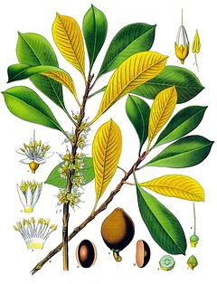
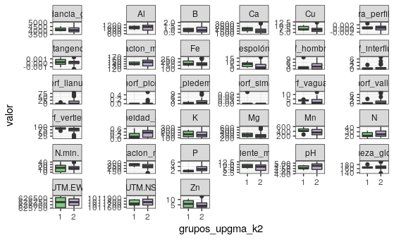
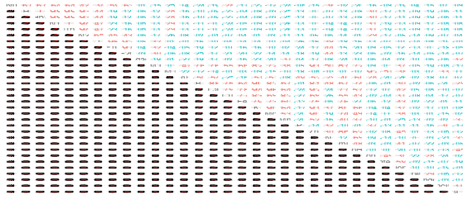

```{r, include=FALSE}
source("Analisis.R", local = knitr::knit_global())
source("analisis_tidyverse.R", local = knitr::knit_global())
source("analisis_correlacion_variables_ambientales.R", local = knitr::knit_global())

```

# Introducción

La familia Sapotaceae...[@martinez2020importancia].

Segun @martinez2020importancia, las hojas de la familia sapotaceae son del tipo...(ver figura\ref{imagen})

La familia Sapotaceae...[@martinez2020importancia;@henriquez2012fenologia].

{width=50%}

| p1  | p2  | p3  |p4   | p5  |
|---|---|---|---|---|
|  10 | 16  | 62  | 33  |  34 |
|  20 |  15 | 22  | 32  | 32  |
|  30 |  38 | 23  | 12  | 46  |


# Metodología

\ldots

# Resultados

En toda la parcela, se registró un total de 2029 pertenecientes a 5 especies. La riqueza por cuadro fue de 4 especies y la mediana de la abundancia por cuadro fue de 39 individuos. La especie más abundante fue *Pouteria reticulata*, con 1084 individuos, y la menos abundante fue *Pouteria fossicola* con 3 individuos. La tabla \ref{tab:abun_sp} y la figura \ref{fig:abun_sp_q} resume estos resultados.


```{r, echo=FALSE}
knitr::kable(abun_sp,
             caption = "\\label{tab:abun_sp}Abundancia por especie de la familia Sapotaceae")
```

```{r, echo=FALSE, fig.cap="\\label{fig:abun_sp_q}Abundancia por especie por quadrat"}
abun_sp_q
```


```{r, echo=FALSE, fig.cap="\\label{fig:P13}Diagrama de cajas de la abundancia y riqueza segun habitats"}
p13
```

la distribucion de la riqueza numerica de especies de la familia Sapotaceae sigue un patron homogeneo, lo cual los agregados de riqueza maxima estan distribuidos en casi todo el area. (ver Figura \ref{fig:mapa_cuadros_riq_mi_familia})


{width=50%}

Las variables ambientales pH y pendiente media presentaron asociacion con la familia de plantas..., lo cual supone... (ver figuras \ref{fig:mapa_cuadros_pH} y \ref{fig:mapa_cuadros_pendiente}).

{width=50%}

{width=50%}

la abundancia de la familia sapotaceae solo presenta correlacion con la abundacia global, mientras que la riqueza tiene correlacion con la presencia de cobre y nitrogeno en el suelo, lo que sugiere... (ver figura \ref{fig:p_cor_suelo_ar}).


```{r, echo=FALSE, fig.cap="\\label{fig:p_cor_suelo_ar}correlacion de las variables del suelo"}
p_cor_suelo_ar
```


las variables ambientales numericas y nominales presentan un patron (ver figuras \ref{fig:mapas_variables_ambientales_numericas} y \ref{fig:mapas_variables_ambientales_nominales}).

{width=100%}


El indice de similaridad de Jaccard muestra que el sitio 1 y 2 comparten un 100% de sus especies, por lo que ambos sitios comparten 3 especies y no tienen especies exclusivas (ver figura \ref{fig:similaridad_jaccard}).


La correlcion entre las variables geomorfologicas con la abundancia y riqueza...(ver figura \ref{fig:matriz_correlacion_geomorf_abun_riq_spearman}). 


Las pruebas de correlación entre los grupos 1 y 2 formulados por upgma...(ver figura \ref{fig:{width=100%}}). 


{width=100%}


La repartición de sitios en los grupos formulados por enlace upgm...(ver figura \ref{fig:mapa_upgma_k2}). 


Las especies indicadoras fueron...(verificar analisis de agrupamiento 4)

Análisis de especies indicadoras mediante IndVal
 Association function: IndVal.g
 Significance level (alpha): 0.05

 Total number of species: 5
 Selected number of species: 2 
 Number of species associated to 1 group: 2 

 List of species associated to each combination: 

 Group 1  #sps.  1 
                             A      B stat p.value   
Chrysophyllum argenteum 0.6565 1.0000 0.81   0.005 **

 Group 2  #sps.  1 
                         A      B  stat p.value    
Pouteria reticulata 0.6505 1.0000 0.807   0.001 ***

grado de correlacion que existe en cado uno de los indices... (ver figura \ref{fig:correlacion_indices}). 


{width=100%}

La riqueza de la familia Sapotaceae aumenta en función del contenido de hierro, nitrógeno y cobre, tambien aunmenta con la equidad (ver figura \ref{fig:correlacion_diversidad_equidad}). 


{width=100%}

Sitios que tienen mayores valores de equidad (azul y verde)... (ver figura \ref{fig:grafico_niveles_equidad}). 


Curva de rarefaccion de los sitios, teniendo en cuenta la riqueza y la abundancia...(ver figura \ref{fig:Curva_rarefaccion}). analizar Analisis de diversidad 1


asymptotic diversity estimates along with related statistics.
                  Observed Estimator Est_s.e. 95% Lower 95% Upper
Species Richness     5.000     5.000    0.217     5.000     5.481
Shannon diversity    2.786     2.789    0.045     2.786     2.876
Simpson diversity    2.403     2.404    0.038     2.403     2.478


  Acumulacion de especies en funcion de numeros de individuos...(ver figura \ref{fig:acumulacion_especies_individuos}).
  
  
  
  


Valores de diversidad beta por cada una de las especies y cuales son su contribucion (comparar cueles son las especies que contribuyen mas a la diveridad beta)
especies_contribuyen_betadiv
Chrysophyllum argenteum   Chrysophyllum cainito      Pouteria stipitata 
              0.2504234               0.3147978               0.2658814 

$sitios_contribuyen_betadiv
[1] "9"  "40"

Estos sitios presentan contribucion a la diversidad beta por la incidencia de algunas variables ambientales (habitat, y variables numericas...)(ver figura \ref{fig:mapas_variables_ambientales_numericas} y \ref{fig: mapas_variables_ambientales_nominales}).
  
  


# Discusión

# Agradecimientos

# Información de soporte

\ldots

# *Script* reproducible

\ldots

# Referencias
