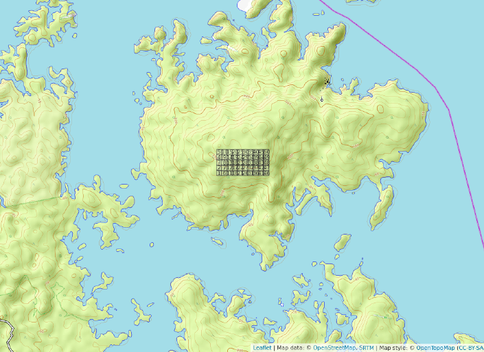
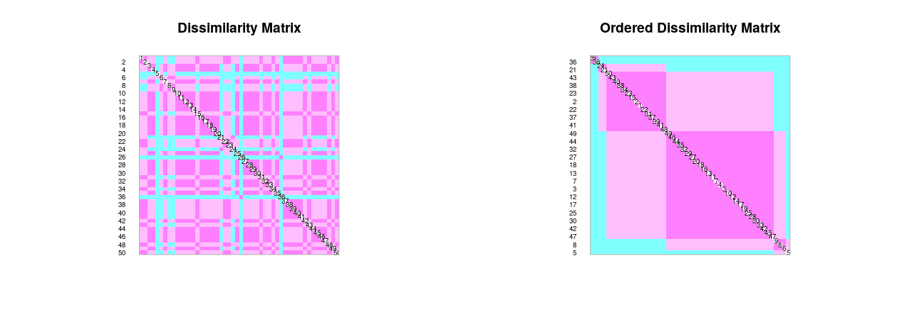
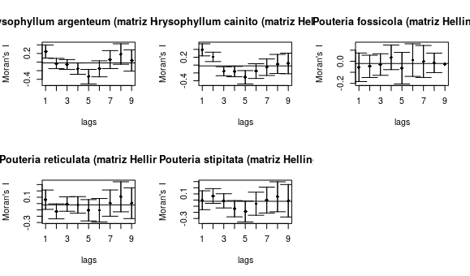

```{r, include=FALSE}
source("Analisis.R", local = knitr::knit_global())
source("analisis_tidyverse.R", local = knitr::knit_global())
source("analisis_correlacion_variables_ambientales.R", local = knitr::knit_global())

```


# Introducción

La diversidad y estructura de los bosques miden los recursos y la abundancia en un área geográfica, y cumplen funciones elementales para mantener la vida, por ejemplo, los bosques tropicales poseen una gran diversidad de especies y complejidad ecológica. Además, cubren un 10% de la superficie terrestre y son de gran importancia para el planeta, debido a que capturan y procesan inmensas cantidades de carbono [@martinez2021diversidad;@campos2017analisis]. 

La familia Sapotaceae está ampliamente distribuida en las zonas tropicales [@smedmark2007boreotropical]. Producen frutas tropicales y algunas especies producen látex, y  madera de alta calidad, siendo una familia de plantas de importancia ecológica y económica [@martinez2020importancia]. Los bosques de la familia Sapotaceae son importantes para proporcionar alimentos a las especies de vida silvestre [@martinez2021diversidad;@wan2020importancia]. 

La  Isla  Barro  Colorado  es  una  reserva  natural  ubicada  en  el lago  Gatún  del  Canal  de Panamá. Debido a su capacidad de investigación, es una de las regiones tropicales más conocidas en materia de biología y ecología tropical [@leigh1990barro]. La isla exhibe características importantes, tres de las cuales son la estabilidad ambiental, su ubicación geográfica (en un área de importancia internacional) y la capacidad para investigar grupos específicos de organismos [@rodriguez2020scolytinae]. Cabe señalar, que en trabajos anteriores [@condit2002beta]  sobre los bosques tropicales de Panamá y el grado de diversidad beta entre especies en diferentes comunidades, indican que la disimilaridad aumenta con la distancia a la que están separadas en el espacio. Sin embargo, estos estudios no minimizan la importancia de la variabilidad del hábitat, y se toma en cuenta en este estudio, ya que un acercamiento inicial a los datos de abundancia de las diferentes especies de la familia Sapotaceae en Barro Colorado arrojaron indicaciones de posibles patrones de su distribución y se plantea la posibilidad de que hay especies con algún grado de asociación con las variables ambientales que allí prevalecen. Por otra parte, aunque la distribución actual de la abundancia de especies se atribuye principalmente a los mecanismos que definen comunidades específicas, como la prevalencia de especies dominantes, que son relativamente más abundantes que las especies raras. Las medidas para la distribución de la abundancia relativa se ve afectada por interacciones que aún no se han determinado plenamente, ni en qué grado inciden en la estructura de la comunidad [@horvat2010spatially].

El objetivo de este trabajo es determinar la asociación, composición florística y distribución de la familia Sapotaceae en la parcela permanente de 50h de la isla Barro Colorado. Además, analizar la organización de las especies en los cuadros de 1 hectárea e identificar si existe algun patrón con alguna variable ambiental, asi como tambien, explicar si hay especies indicadoras o con preferencia por determinadas condiciones ambientales. Por otra parte, evaluar si la familia Sapotaceae esta suficientemente representada segun los análisis de estimación de riqueza, determinar cuales son las variables ambientales que presentan asociacion con la diversidad alpha y mostrar cuales son las especies que contribuyen a la diversidad beta. Por ultimo, pero no menos importante, examinar la autocorrelación espacial de las especies. 


# Metodología


## Área de Estudio


La isla de Barro Colorado es una colina de 1,500 hectáreas ubicada a 137 msnm en el lago Gatún. La parte superior de la isla es ancha y plana, y se asienta sobre un lecho de roca de basalto, de la cual irradian colinas empinadas y valles tallados en rocas sedimentarias que contienen gran cantidad de restos volcánicos. El suelo es arcilloso y la profundidad varía de 50 cm a un metro. El clima es típico de las areas tropicales [@perez2005metodologia;@windsorestructura]. 

La parcela permanente de árboles de 50 hectáreas se estableció en 1980 en el bosque húmedo tropical. El sitio es un rectángulo de 1,000 m de largo por 500 m de ancho, ubicado en la meseta central de la isla. Está dividido en 1,250 cuadrantes de 20x20 m, en el cual se han contabilizado todos los arboles con más de 10 mm de diámetro a la altura del pecho cada cinco años desde 1985 [@perez2005metodologia;@condit2012thirty;@condit2017demographic] (ver mapa \ref{fig:Mapa}). 


{width=50%}


## Materiales y Métodos


La información de los cuadrantes que componen BCI fue procesada en R [@Restudio], teniendo en cuenta la matriz ambiental y la matriz de comunidad, los cuales contienen datos de las variables ambientales, tales como condiciones edáficas, tipo de hábitat, topografía del lugar, clasificación etaria del bosque, y datos demográficos y geoferenciación espacial de todos los individuos censados. Se adaptaron scripts reproducibles recuperados de @jose_ramon_martinez_batlle_2020_4402362, utilizando la colección de paquetes multifuncionales: vegan [@vegan], Tidyverse [@tidyverse], BiodiversityR [@diversityanalysis] y indicspecies [@indicspecies]. 

Para conocer las características de los datos almacenados de la matriz de comunidad y ambiental, se realizó un análisis exploratorio que incluyó visualización de gráficos, tablas, mapas de los cuadrantes de una hectárea y tablas de correlación lineal entre las dos variables de la matriz, lo que permitió una vista común y ayudó a determinar procedimientos más detallados a continuación.

## Medición de asociación (ma)

Para realizar las pruebas de medición de asociación, se calculó la distancia euclidiana entre los cuadrados considerados objetos. Para ello, se requierió una transformación de la matriz de comunidad mediante el método Hellinger, que incluye elevar al cuadrado la abundancia relativa yij (cociente resultante de cada valor de abundancia entre la suma de los sitios)[@legendre2001ecologically]. Además, se evaluó la distancia euclidiana entre los cuadrantes en términos de ocurrencia de especies. Se utilizó el índice de disimilitud de Jaccard de la matriz normalizada para convertir el valor de abundancia en un valor binario [@brocard2011numerical]. del mismo modo, se empleó la métrica de Jaccard para aplicar la transposición de la matriz de la comunidad y convertir a datos Presencia / ausencia para medir el grado de asociación entre especies.

Para poder comparar la relación entre especies en función de su abundancia, se utilizó estandarización _ji_-cuadrado de la matriz de comunidad transpuesta [@legendre2001ecologically]. Se examinó la ocurrencia entre especies y su distribución en BCI por el coeficiente de correlación entre rangos de Spearman, para medir el grado de correlación entre las variables riqueza númerica de especies y la abundancia con las variables ambientales geomorfológicas, y la
composición química del suelo [@brocard2011numerical].

##Análisis de agrupamiento 


El método jerárquico aglomerativo de asociación entre pares de cuadrantes (según la composición de especies) bajo el estándar de enlace completo, y el método de Ward basado en la varianza mínima, se utilizó como método preliminar para el análisis de agrupamiento, con el fin de  probar su efectividad en lograr un grupo consistente de importancia ecológica [@brocard2011numerical]. Luego, estos generaron dendrogramas que posteriormente son comparados con la matriz de distancia de cuerdas [@legendre2001ecologically]. Usando correlación cofenética entre los dos para determinar el número ideal de grupos. Además, se utilizó remuestreo bootstrap y boostrap multiescalar para conocer la probabilidad de éxito de la inferencia del número de grupos y la identidad de sus componentes [@brocard2011numerical]. Las distribuciones se basaban en una probabilidad de 91% o más de acierto para el método bootstrap y de un 95% para boostrap multiescalar.

Para conocer las especies distintas o asociadas a cada grupo, se utilizó el valor del indicador o índice IndVal [@dufrene1997species], basado en permutaciones aleatorias de los sitios según la presencia de especies y la abundancia de estos. De manera similar, el grado de asociación de una especie con una preferencia particular por el grupo de cuadrantes considerado grupo en estudio, expresado como el coeficiente de correlación biserial puntual [@brocard2011numerical]. Se adoptó un enfoque similar al anterior a lo largo de las pruebas estadísticas de la hipótesis nula, basada en las especies presentes en los cuadrantes pertenecientes a un determinado grupo realizado al azar. Esta prueba se hizo reordenando aleatoriamente los valores de abundancia y comparando sus distribuciones con las obtenidas previamente [@caceres2009associations]. 

##Análisis de diversidad alpha

La diversidad alpha representa la diversidad de especies a lo largo de todas las subunidades locales relevantes, y por definición abarca dos variables importantes: (1) la riqueza de especies, y (2) la abundancia relativa de especies [@carmona2013diversidad]. Con el fin de determinar la diversidad alpha se utilizaron métodos como la Entropia de Shannon H1, que calcula el grado de desorden en la muestra, el índice de concentración de Simpson, que calcula la probabilidad de que dos individuos seleccionados aleatoriamente puedan ser de la misma especie. Ademas, se empleó la serie de números de diversidad de Hill, la fórmula de la entropía de Rengi y el índice de equidad de Pielou. 

##Analisis de diversidad beta

La diversidad beta, de acuerdo con [@whittaker1960vegetation], se define como el diferencial entre la diversidad de un hábitat y la diversidad total de un paisaje de hábitats. Teniendo en cuenta lo anterior, se utilizó el metodo hellinger para determinar cuales son las especies que contribuyen a la diversidad beta, es decir, las especies que no se encuentran compartidas entre los cuadrantes. 

## Análisis de ordenación simple (no restringida) y canónica (restringida) 

Se aplicaron los análisis de componentes principales o PCA a los datos de las variables ambientale para determianar la ordenacion no restringida, donde se tomó en cuenta especificamente las variables del suelo. y para determinar la ordenacion restringida se exploró de manera explícita las relaciones entre una matriz de respuesta y una matriz explicativa con los análisis de redundancia o RDA, lo cual combina la regresión y el análisis de componentes principales (PCA), por ejemplo, busca tendencias en la matriz de comunidad  restringiéndolas a la matriz ambiental. 

##Ecología espacial

En ecología espacial se utilizó la matriz transformada de hellinger y la matriz ambiental para crear un cuadro de vecindad y ver como se autocorrelacionan los sitios. Se genera un correlograma para la variable que queremos estudiar mediante la función ‘sp.correlogram’ y para varias variables como la abundancia de especies y las variables ambientales. También, se utilizaron otros métodos como la prueba Mantel con matrices de distancia para autocorrelación espacial con y sin tendencia, y el I de Moran con una matriz de abundancia de especies transformada sin tendencia, lo cual se aplica a variables ambientales para obtener los datos de autocorrelación, distribución de especies y variables en los sitios de muestreo.


# Resultados

Se registraron un total de 5 especies y 2 generos distribuidos en 2029 individuos en toda la parcela. La riqueza por cuadro fue de 4 especies y la mediana de la abundancia por cuadro fue de 39 individuos. La especie más abundante fue *Pouteria reticulata*, con 1084 individuos, y la menos abundante fue *Pouteria fossicola* con 3 individuos. La tabla \ref{tab:abun_sp} y la figura \ref{fig:abun_sp_q} resume estos resultados. La distribución de la riqueza númerica de especies de la familia Sapotaceae sigue un patrón homogeneo, lo cual los agregados de riqueza máxima están distribuidos en casi todo el área (ver Figura \ref{fig:mapa_cuadros_riq_mi_familia}). Cabe resaltar, que la distribución de las variables ambientales PH y pendiente media siguen un patrón relativamente similar a la distribución de la riqueza númerica de la familia Sapotaceae.
```{r, echo=FALSE}
knitr::kable(abun_sp,
             caption = "\\label{tab:abun_sp}Abundancia por especie de la familia Sapotaceae")
```

```{r, echo=FALSE, fig.cap="\\label{fig:abun_sp_q}Abundancia por especie por quadrat"}
abun_sp_q
```

{width=50%}

Los valores para el coeficiente de Spearman presentados en el panel de correlación de la figura
\ref{fig:p_cor_suelo_ar}, mostraron que la abundancia de la familia sapotaceae solo presenta correlación con la abundacia global, mientras que la riqueza tiene correlación con la presencia de cobre y nitrógeno en el suelo, lo que sugiere, que mientras mas concentración de cobre y nitrógeno hay, mayor será la riqueza de especies.


```{r, echo=FALSE, fig.cap="\\label{fig:p_cor_suelo_ar}correlacion de las variables del suelo"}
p_cor_suelo_ar
```


 El índice de similaridad de Jaccard muestra que el sitio 1 y 2 comparten un 100% de sus especies, por lo que ambos sitios comparten 3 especies y no tienen especies exclusivas (ver figura \ref{fig:similaridad_jaccard}). Las variables geomorfológicas presentan asociación con la abundancia y riqueza, lo cual la figura \ref{fig:matriz_correlacion_geomorf_abun_riq_spearman} muestra que hay mucha similaridad entre estas variables. Las pruebas de correlación entre los grupos 1 y 2 formulados por upgma resultaron significativas respecto a la variable fósforo. Por otro lado, el contenido de cobre y la abundancia global promedio, es decir, la media correspondiente a todas las plantas en BCI, son significativamente diferentes entre los sitios de ambos grupos, para un nivel de significancia de a = 0.1(ver figura \ref{fig:grupos_upgma}).
 
 El grupo 1 generado por enlace upgm esta conformado por 5 cuadrante y el grupo 2 por 46 cuadrantes (ver figura \ref{fig:mapa_upgma_k2}). El grupo 2 contiene los sitios con tendencia a presentar valores altos de zinc y contenido de cobre. Es probable que las especies indicadoras del grupo con un mayor contenido de cobre estén mostrando preferencia por estas condiciones ambientales. No obstante, la mayoría de componentes del suelo en BCI tienen valores bastante homogéneos, y más bien se presentan pequeños gradientes entre los cuadrantes, lo cual evita que este tipo de acercamiento sea concluyente. La especie _Chrysophyllum argenteum_ fué la que obtuvo un valor alto de confianza al examinar su potencial como especies indicadoras del grupo 1. Para el caso del grupo 2, la especie indicadora fué _Pouteria reticulata_.
 

{width=100%}

 

{width=100%}


{width=100%}

{width=50%}


La riqueza de la familia Sapotaceae aumenta en función del contenido de hidrógeno, nitrógeno y cobre. Ademas, aunmenta con la equidad. Cabe destacar, que algunos sitios de BCI tienen valores altos de equidad (ver figura \ref{fig:grafico_niveles_equidad}). La Curva de rarefaccion de los sitios, muestra como va aumentando la cantidad de individuos y de especies de los cuadrantes (ver figura \ref{fig:Curva_rarefaccion}), donde la mayor concentración de individuos está entre los 20 a 50 individuos y la abundancia maxima es de 70 individuos. Los valores de los indices de diversidad alfa fueron: Riqueza de especies  0.22, Shannon 0.05 y Simpson  0.04. 


  
  Las especies que contribuyen de manera significativa a la diversidad beta fueron: _Chrysophyllum argenteum_ (0.2504234), _Chrysophyllum cainito_ (0.3147978) y _Pouteria stipitata_ (0.2658814), de las cuales la que mas contribuyó a la diversidad beta fué _Chrysophyllum cainito_. No obstante, los sitios que contribuyen a la diversidad beta son los cuadrantes 9 y 40, lo cual presentan contribución a la diversidad beta por la incidencia de algunas variables ambientales.

El gráfico \ref{fig:env_suelo_pca} incluye el comportamiento de los componentes principales de la varianza en las variables suelo y geomorfologia en BCI, predecido por el modelo de barra quebrada, representado por la línea roja formando la curva (La escala denominada “Inertia” representa la suma de los cuadrados de toda la varianza). En el diagrama rotulado como escalamiento 1 de la figura \ref{fig:Biplot_PCA_escalamiento}, se observan tres grupos de cuadrantes diferenciados entre sí. Un grupo de sitios con un alto grado de acidez y contenido en aluminio, otro grupo caracterizado por la presencia de elementos metálicos, y un tercero, con una
cantidad de fósforo, nitrógeno y valor de pH mayor. Las variables nitrógeno, fósforo y pH aportan la mayor parte de la varianza explicada. La relación entre las variables se encuentra debidamente representada en el recuadro del escalamiento 2, por medio de los ángulos que forman sus vectores (ver figura \ref{fig:Biplot_PCA_escalamiento}). Los resultados del PCA de los datos de la matriz de comunidad se encuentran resumidos en los diagramas de la figura \ref{fig:PCA_comunidad}. El escalamiento 1, muestra muchos de los cuadrantes dispuestos alrededor del origen formado por los ejes, lo que indica una contribución a la varianza relativamente equitativa por parte de las especies.
   
  
  
  
  
  {width=100%}


  {width=100%}


El escalamiento 2 de la figura \ref{fig:Analisis_de_correspondencia} en el análisis de correspondencia mostró que las especies _Pouteria reticulata_, _Chrysophyllum argenteum_ y _Chrysophyllum cainito_ se encuentran asociadas. Las especies restantes tienen una abundancia reducida, y en consecuencia, aparecen cercanas a los pocos cuadrantes en los que se encuentran representadas. La disparidad en la incidencia de las especies se refleja en su disposición en el diagrama. Sin embargo, estos resultados no coinciden del todo con los arrojados por el PCA de la matriz de distancias.

Los primero ordenes de _Chrysophyllum argenteum_ y _Chrysophyllum cainito_ presentan valores de autocorrelación alta o positiva, mientras que los ordenes de las demas especies presentan mayormente valores de autocorrelación negativa (Ver figura \ref{fig:Abundancia_matriz}). 
  
  
  {width=100%}


  {width=100%}
  
  
  
# Discusión

Estudios de la familia Sapotaceae también reportan que *Pouteria* es un género que parece siempre presentar una cantidad significativa de individuos [@martinez2021diversidad]. La riqueza de la familia Sapotaceae aumenta en función del contenido de hidrógeno, nitrógeno y cobre, los cuales son algunos de los nutrientes que más se correlacionan con la diversidad de especies de plantas en el neotrópico [@doblado2011identificacion]. Ademas, la riqueza aunmenta con la equidad, debido a que las especies estan distribuidas en casi todos los cuadrantes. 
 
Los valores de los indices de diversidad alfa fueron muy bajos, lo que sugiere que la familia Sapotaceae no presenta mucha diversidad en BCI. Se estima que la riqueza seguiría constante o no aumentaría significativamente aunque se hiciera mayor esfuerzo de muestreo (ver figura \ref{fig:acumulacion_especies_individuos}). 

 
 
 
Las especies que contribuyen de manera significativa a la diversidad beta fueron: _Chrysophyllum argenteum_, _Chrysophyllum cainito_ y _Pouteria stipitata_, las cuales fueron las que obtuvieron valores intermedios de individuos. No obstante, los sitios que contribuyen a la diversidad beta son los cuadrantes 9 y 40, ya presentan contribución por la incidencia de algunas variables ambientales, tales como PH, aluminio, boro, manganeso, etc. Lo anterior coincide con [@horvat2010spatially], lo cual explica que las medidas para la distribución de la abundancia relativa se ve afectada por interacciones, que en este caso se debe a la incidencia de algunas variables ambientales. Además, [@condit2002beta] señala que la diversidad beta aumenta dependiendo la distancia que estan separadas las especies o los sitios donde se encuentran estas. Las especies _Pouteria reticulata_, _Chrysophyllum argenteum_ y _Chrysophyllum cainito_ se encuentran asociadas, debido a que tienen los valores mas altos de abundancia dentro de la comunidad (1084, 711 y 171 individuos, respectivamente). 
 
Los primero ordenes de _Chrysophyllum argenteum_ y _Chrysophyllum cainito_ presentan valores de autocorrelación positiva, mientras que los ordenes de las demás especies presentan mayormente valores de autocorrelación negativa, teniendo en cuenta que el orden 5 de todas las especies presenta autocorrelacion negativa, lo que sugiere que el orden 5 de las especies está autocorrelacionado espacialmente negativo. 
 
# Agradecimientos

Agradezco al maestro José Ramón Martinez, por su motivación y ayuda en todos los aspectos para que este trabajo salga bien.

# Información de soporte

\ldots

# *Script* reproducible


# Referencias
