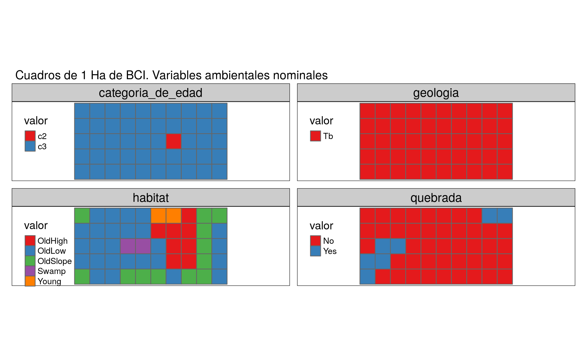
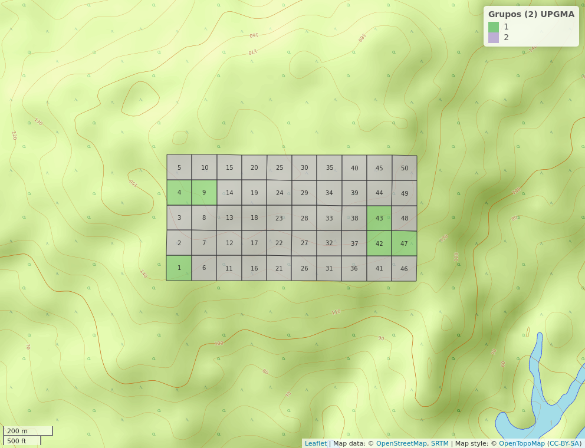

```{r, include=FALSE}
source("Analisis.R", local = knitr::knit_global())
source("analisis_tidyverse.R", local = knitr::knit_global())
source("analisis_correlacion_variables_ambientales.R", local = knitr::knit_global())

```

# Introducción

La diversidad y estructura de los bosques miden los recursos y la abundancia en un área geográfica, por ejemplo, los bosques de la familia Sapotaceae son importantes para proporcionar alimento a las especies de vida silvestre [@martinez2021diversidad]. La familia Sapotaceae está ampliamente distribuida en la zonas tropicales [@smedmark2007boreotropical]. Produce madera de alta calidad, frutas tropicales y algunas especies producen látex, siendo una familia de plantas de importancia ecológica y económica [@martinez2020importancia].

La  Isla  Barro  Colorado  es  una  reserva  natural  ubicada  en  el lago  Gatún  del  Canal  de Panamá. Debido a su capacidad de investigación, es una de las regiones tropicales más conocidas en materia de biología y ecología tropical [@leigh1990barro].La isla exhibe características importantes, tres de las cuales son la estabilidad ambiental, su ubicación geográfica (en un área de importancia internacional) y la capacidad para investigar grupos específicos de organismos [@rodriguez2020scolytinae]. Sin  embargo, no se han hecho estudios completos de la familia Sapotaceae, donde se estudie los diferentes analisis de ecologia numerica. 

El objetivo de este trabajo es determinar la asociacion, composicion floristica y distribucion de la familia Sapotaceae en la parcela permanente de 50h de la isla Barro Colorado. Ademas, analizar la organizacion de las especies en los cuadros de 1 hectárea e identificar si existe algun patron con alguna variable ambiental, asi como tambien, explicar si hay especies indicadoras o con preferencia por determinadas condiciones ambientales. Por otra parte, evaluar si la familia sapotaceae esta suficientemente representada segun los análisis de estimación de riqueza, determinar cuales son las variables ambientales que presentan asociacion con la diversidad alpha y mostrar cuales son las especies que contribuyen a la diversidad beta. Por ultimo, pero no menos importante, examinar en un espacio bidimensional las tendencias de ordenacion de las especies y determinar si las especies presentan patron aglomerado.  


# Metodología


## Area de Estudio


La isla de Barro Colorado es una colina de 1,500 hectáreas ubicada a 137 msnm en el lago Gatún. La parte superior de la isla es ancha y plana, y se asienta sobre un lecho de roca de basalto, de la cual irradian colinas empinadas y valles tallados en rocas sedimentarias que contienen gran cantidad de restos volcánicos. El suelo es arcilloso y la profundidad varía de 50 cm a un metro. El clima es típico de las areas tropicales [@perez2005metodologia;@windsorestructura]. Su vegetación está formada por bosques semideciduos de tierras bajas, y se han registrado más de 1,300 especies de plantas vasculares [@croat1978flora]. 

La parcela permanente de árboles de 50 hectáreas se estableció en 1980 en el bosque húmedo tropical. El sitio es un rectángulo de 1,000 m de largo por 500 m de ancho, ubicado en la meseta central de la isla. Está dividido en 1,250 cuadrantes de 20x20 m, en el cual se han contabilizado todos
los arboles con más de 10 mm de diámetro a la altura del pecho cada cinco años desde 1985 [@perez2005metodologia;@condit2012thirty;@condit2017demographic] (ver figura \ref{fig:mapabarro}). 


{width=100%}


## Maeriales y Metodos


Los datos de cada uno de los cuadrantes de una hectárea que componen BCI, fueron procesados en R [@Restudio], teniendo en cuenta la matriz ambiental y la matriz de comunidad, lo cuales contienen datos de las variables ambientales, tales como condiciones edaficas, tipo de habitat, topografia del lugar, clasificacion etaria del bosque, y datos demograficos y geoferenciacion espacial de todos los individuos censados. Se adaptaron scripts reproducibles recuperados de @jose_ramon_martinez_batlle_2020_4402362, utilizando la colección
de paquetes multifuncionales vegan [@vegan], Tidyverse [@tidyverse], BiodiversityR [@diversityanalysis] y indicspecies [@indicspecies]. 

Para conocer las características de los datos almacenados de la matriz de comunidad y ambiental, se realizó un análisis exploratorio que incluyó visualización de gráficos, tablas, mapas de los cuadrantes de una hectárea y tablas de correlación lineal entre las dos variables de la matriz, lo que permitió una vista común y ayudó a determinar procedimientos más detallados a continuación.

## Medición de asociación (ma)

Para realizar las pruebas de medicion de asociacion, se calculó la distancia euclidiana entre los cuadrados considerados objetos. Para ello, se requierió una transformación de la matriz de comunidad mediante el método Hellinger, que incluye elevar al cuadrado la abundancia relativa yij (cociente resultante de cada valor de abundancia entre la suma de los sitios), como muestra la formula \ref{fig:formula}. Donde j denota cada tipo o columna de la matriz, i es la fila o cuadrante e i+ representa la suma de filas de la matriz de la i-ésima fila [@legendre2001ecologically]. Además, se evaluó la distancia euclidiana entre los cuadrantes en términos de ocurrencia de especies. Se utilizó el índice de disimilitud de Jaccard de la matriz normalizada para convertir el valor de abundancia en un valor binario [@brocard2011numerical]. del mismo modo, se empleó la métrica de Jaccard para aplicar la transposición de la matriz de la comunidad y convertir a datos Presencia / ausencia para medir el grado de asociación entre especies.


{width=100%}


Para poder comparar la relación entre especies en función de su abundancia, se utilizó estandarización ji-cuadrado de la matriz de comunidad transpuesta [@legendre2001ecologically]. Se examinó la ocurrencia entre especies y su distribución en BCI por el coeficiente de orrelación entre rangos de Spearman  para medir el grado de correlación entre las variables riqueza númerica de especies y la abundancia con las variables ambientales geomorfológicas, y la
composición química del suelo[@brocard2011numerical].

##Analisis de agrupamiento 


El método jerarquico aglomerativo de asociación entre pares de cuadrantes (según la composición de especies) bajo el estándar de enlace completo, y el método de Ward basado en la varianza mínima, se utilizan como método preliminar para el análisis de agrupamiento, con el fin de  probar su efectividad en lograr un grupo consistente de importancia ecológica [@brocard2011numerical]. Luego, estos generaron dendrogramas que posteriormente son comparados con la matriz de distancia de cuerdas [@legendre2001ecologically]. Usando correlación cofenética entre los dos para determinar el número ideal de grupos. Además, se utilizó remuestreo bootstrap y boostrap multiescalar para conocer la probabilidad de éxito de la inferencia del número de grupos y la identidad de sus componentes [@brocard2011numerical]. Las distribuciones se basaban en una probabilidad de 91% o más de acierto para el método bootstrap y de un 95% para boostrap multiescalar.

Dado que se localizaron patrones consistentes en la composicion y numero de grupos entre los metodos examinados, los análisis de agruoamiento posteriores se basan en los que se produce por enlace completo e incluye dos grupos compuestos por 20 y 30 cuadrantes, respectivamente(ver figura \ref{fig:Dendograma}).


{width=100%}

Para conocer las especies distintas o asociadas a cada grupo, se utiliza el valor del indicador o índice IndVal [@dufrene1997species], basado en permutaciones aleatorias de los sitios según la presencia de especies y la abundancia de estos. De manera similar, el grado de asociación de una especie con una preferencia particular por el grupo de cuadrantes considerado grupo en estudio, expresado como el coeficiente de correlación biserial puntual [@brocard2011numerical]. Se adoptó un enfoque similar al anterior a lo largo de las pruebas estadísticas de la hipótesis nula, basada en las especies presentes en los cuadrantes pertenecientes a un determinado grupo realizado al azar. Esta prueba se hizo reordenando aleatoriamente los valores de abundancia y comparando sus distribuciones con las obtenidas previamente [@caceres2009associations]. 

##Análisis de diversidad alpha y beta

La diversidad alpha representa la diversidad de especies a lo largo de todas las subunidades (o escalas) locales relevantes (e.g. hábitat), y por definición abarca dos variables importantes: (1) la riqueza de especies, y (2) la abundancia relativa de especies [@carmona2013diversidad]. Para calcular la diversidad alpha se utilizo el indice de  Fisher [@fisher1943relation], el índice de Simpson [@simpson1949measurement], y el índice de Shannon-Wiener [@shannon1948mathematical]. Estos índices de diversidad alpha utilizaron los valores de riqueza y abundancia relativa, solamente que las operaciones matemáticas de estos valores se organizan de diferentes formas.  Por ejemplo, el
índice de Shannon-Wiener, se calculará de acuerdo a la fórmula \ref{fig:indice_shannon}:


{width=50%}

Donde la variable “pi” representa la proporción de la abundancia relativa de la especie “i” en relación a la abundancia de todas las especies detectadas del muestreo. El valor mínimo puede aproximarse al cero y el valor máximo, en teoría, no está consolidado a un límite. El valor (H) del índice Shannon-Wiener aumenta con respecto a una de dos razones: (1) un aumento en la riqueza de especies, y/ o (2) un aumento en la equitatividad de la representación de la
abundancia relativa especies. Es decir, cuando el índice de diversidad alpha aumenta, el número del índice en si no es suficiente para determinar si el cambio es por un aumento en la riqueza o equitatividad de especies. Por esta razón, los índices de diversidad-alfa siempre se reportaran en conjunto con los análisis de riqueza y equitatividad de especies detectadas en el muestreo [@carmona2013diversidad]. 

Cada índice de diversidad alpha tiene su propia fórmula para calcular la equitatividad de especies. Por ejemplo, índice de Shannon-Wiener se puede utilizar para calcular equitatividad de especies de acuerdo a la fórmula \ref{fig:equidad}: donde la variable “H” es el índice de Shannon-Wiener y la variable “S” es la riqueza de especies detectadas durante el muestreo. El valor (J) de la equitatividad de especies varía entre los valores “0” y “1”; donde el valor “0” representa baja equitatividad (o alta dominancia por pocas especies) y el valor “1” representa total equitatividad en la representación de individuos de cada especie detectada en el muestreo [@carmona2013diversidad].

{width=50%}

Para determinar la rarefaccion se compararo los índices de diversidad entre hábitats en base a un mismo número de individuos, donde
el hábitat con el mayor número de individuos se submuestreo sin remplazo aleatoriamente y con múltiples ejecuciones para generar un índice promedio que se pueda comparar con el índice de otro hábitat en base
a un mismo número de individuos. El resultado de esta técnica resulto con una curva rarificada de valores del índice de diversidad que disminuye conforme con el muestreo sin remplazo del número de individuos[@carmona2013diversidad].


Sitios que tienen mayores valores de equidad (azul y verde)... (ver figura \ref{fig:grafico_niveles_equidad}). 

Curva de rarefaccion de los sitios, teniendo en cuenta la riqueza y la abundancia...(ver figura \ref{fig:Curva_rarefaccion}). analizar Analisis de diversidad 1

Acumulacion de especies en funcion de numeros de individuos...(ver figura \ref{fig:acumulacion_especies_individuos}).


# Resultados

En toda la parcela, se registró un total de 2029 pertenecientes a 5 especies. La riqueza por cuadro fue de 4 especies y la mediana de la abundancia por cuadro fue de 39 individuos. La especie más abundante fue *Pouteria reticulata*, con 1084 individuos, y la menos abundante fue *Pouteria fossicola* con 3 individuos. La tabla \ref{tab:abun_sp} y la figura \ref{fig:abun_sp_q} resume estos resultados.


```{r, echo=FALSE}
knitr::kable(abun_sp,
             caption = "\\label{tab:abun_sp}Abundancia por especie de la familia Sapotaceae")
```

```{r, echo=FALSE, fig.cap="\\label{fig:abun_sp_q}Abundancia por especie por quadrat"}
abun_sp_q
```


```{r, echo=FALSE, fig.cap="\\label{fig:P13}Diagrama de cajas de la abundancia y riqueza segun habitats"}
p13
```

la distribucion de la riqueza numerica de especies de la familia Sapotaceae sigue un patron homogeneo, lo cual los agregados de riqueza maxima estan distribuidos en casi todo el area. (ver Figura \ref{fig:mapa_cuadros_riq_mi_familia})


{width=50%}

Las variables ambientales pH y pendiente media presentaron asociacion con la familia de plantas..., lo cual supone... (ver figuras \ref{fig:mapa_cuadros_pH} y \ref{fig:mapa_cuadros_pendiente}).

{width=50%}

{width=50%}

la abundancia de la familia sapotaceae solo presenta correlacion con la abundacia global, mientras que la riqueza tiene correlacion con la presencia de cobre y nitrogeno en el suelo, lo que sugiere... (ver figura \ref{fig:p_cor_suelo_ar}).


```{r, echo=FALSE, fig.cap="\\label{fig:p_cor_suelo_ar}correlacion de las variables del suelo"}
p_cor_suelo_ar
```


las variables ambientales numericas y nominales presentan un patron (ver figuras \ref{fig:mapas_variables_ambientales_numericas} y \ref{fig:mapas_variables_ambientales_nominales}).

{width=100%}



El indice de similaridad de Jaccard muestra que el sitio 1 y 2 comparten un 100% de sus especies, por lo que ambos sitios comparten 3 especies y no tienen especies exclusivas (ver figura \ref{fig:similaridad_jaccard}).


La correlcion entre las variables geomorfologicas con la abundancia y riqueza...(ver figura \ref{fig:matriz_correlacion_geomorf_abun_riq_spearman}). 


Las pruebas de correlación entre los grupos 1 y 2 formulados por upgma...(ver figura \ref{fig:grupos_upgma}). 


{width=100%}


La repartición de sitios en los grupos formulados por enlace upgm...(ver figura \ref{fig:mapa_upgma_k2}). 




Las especies indicadoras fueron...(verificar analisis de agrupamiento 4)

Análisis de especies indicadoras mediante IndVal
 Association function: IndVal.g
 Significance level (alpha): 0.05

 Total number of species: 5
 Selected number of species: 2 
 Number of species associated to 1 group: 2 

 List of species associated to each combination: 

 Group 1  #sps.  1 
                             A      B stat p.value   
Chrysophyllum argenteum 0.6565 1.0000 0.81   0.005 **

 Group 2  #sps.  1 
                         A      B  stat p.value    
Pouteria reticulata 0.6505 1.0000 0.807   0.001 ***

grado de correlacion que existe en cado uno de los indices... (ver figura \ref{fig:correlacion_indices}). 


{width=100%}

La riqueza de la familia Sapotaceae aumenta en función del contenido de hierro, nitrógeno y cobre, tambien aunmenta con la equidad (ver figura \ref{fig:correlacion_diversidad_equidad}). 


{width=100%}

Sitios que tienen mayores valores de equidad (azul y verde)... (ver figura \ref{fig:grafico_niveles_equidad}). 


Curva de rarefaccion de los sitios, teniendo en cuenta la riqueza y la abundancia...(ver figura \ref{fig:Curva_rarefaccion}). analizar Analisis de diversidad 1


asymptotic diversity estimates along with related statistics.
                  Observed Estimator Est_s.e. 95% Lower 95% Upper
Species Richness     5.000     5.000    0.217     5.000     5.481
Shannon diversity    2.786     2.789    0.045     2.786     2.876
Simpson diversity    2.403     2.404    0.038     2.403     2.478


  Acumulacion de especies en funcion de numeros de individuos...(ver figura \ref{fig:acumulacion_especies_individuos}).
  
  
  
  


Valores de diversidad beta por cada una de las especies y cuales son su contribucion (comparar cueles son las especies que contribuyen mas a la diveridad beta)
especies_contribuyen_betadiv
Chrysophyllum argenteum   Chrysophyllum cainito      Pouteria stipitata 
              0.2504234               0.3147978               0.2658814 

$sitios_contribuyen_betadiv
[1] "9"  "40"

Estos sitios presentan contribucion a la diversidad beta por la incidencia de algunas variables ambientales (habitat, y variables numericas...)(ver figura \ref{fig:mapas_variables_ambientales_numericas} y \ref{fig:mapas_variables_ambientales_nominales}).

Componentes príncipales de la varianza en las variables de suelo y geomorfología en
BCI.En estos gráficos se incluye el comportamiento de la varianza explicada, predecido por el
modelo de bara quebrada, representado por la línea roja formando la curva. (La escala denominada “Inertia” representa la suma de los cuadrados de toda la varianza) (ver figura \ref{fig:env_suelo_pca}).
  
  
  
  
  
  
Se observa que las variables nitrógeno, fósforo y pH aportan la mayor parte de la varianza explicada. La relación entre las variables se encuentra debidamente representada en el recuadro del escalamiento 2, por medio delos ángulos que forman sus vectores (ver figura \ref{fig:Biplot_PCA_escalamiento}).
  
  
  
  {width=100%}

El escalamiento 1, muestra muchos de los cuadrantes dispuestos alrededor del origen formado por los ejes, lo que indica una contribución a la varianza relativamente
equitativa por parte de las especies. Sin embargo, aparecen también unos cuantos cuadrantes con valores atípicos y más alejados. Se nota como las especies (mencionar especies) presentan una contribución desproporcionada a la varianza total, en comparación
con el resto de las especies (ver figura \ref{fig:PCA_comunidad}).
  
  
  
  {width=100%}


Biplot del análisis de correspondencia de los datos de abundancia de las especies de
Sapotaceae (ver figura \ref{fig:Analisis_de_correspondencia}).
  
  
  
  {width=100%}


(ver figura \ref{fig:PCoA _promedios_especies}).
  
  
  
  {width=100%}
  
(ver figura \ref{fig:PCoA _promedios_especies}).
  
  
  
  {width=100%}
  
# Discusión

# Agradecimientos

# Información de soporte

\ldots

# *Script* reproducible

\ldots

# Referencias
